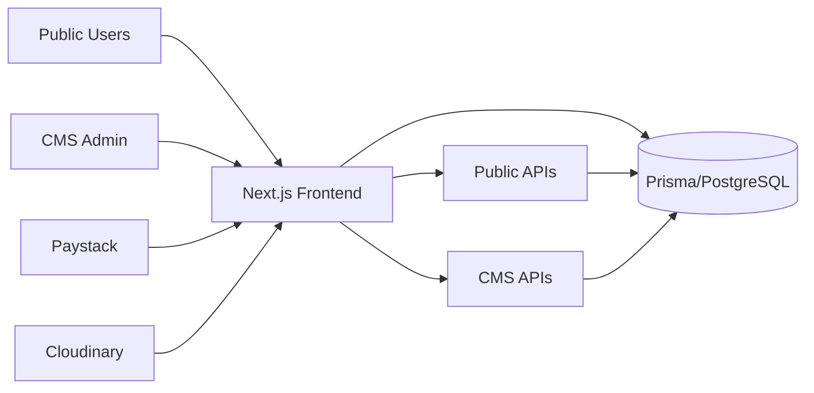
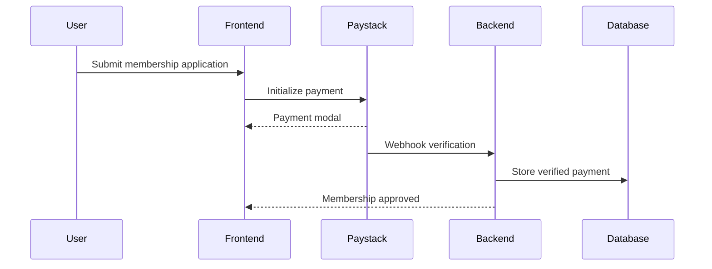
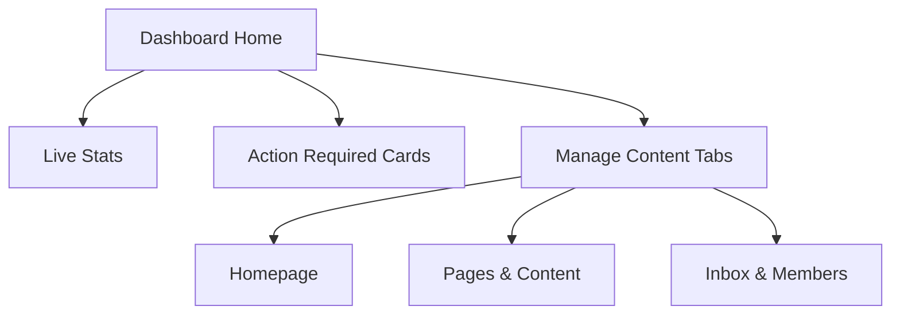

##  Overview

This PR transforms the Ghana Chemical Society platform from a mostly static marketing website into a **fully CMS-driven platform** with:

- 🔐 Secure admin CMS
- 💳 Membership payments via Paystack
- 🧑‍💼 Member management system
- 📬 Inbox & registration management
- 📰 Dynamic publications/news/events
- 🛡️ Offline database resilience
- 📊 Redesigned dashboard experience

---

#  System Architecture



---

# Major Features

## 🛠️ CMS Management (`/cms`)

### Authentication & Security
- JWT authentication
- First admin registration flow
- Protected CMS routes via middleware
- Session-aware admin dashboard

### CMS Content Areas
Admins can manage:

| Module | Features |
|---|---|
| Homepage | Hero carousel, mission strip, join block |
| Partnerships | Logos, links, partner info |
| News | CRUD news management |
| Publications | Publications + author/reader contact emails |
| Events | Events + registration forms |
| About Page | Dynamic sections/images/content |
| Contact Page | Contact settings/content |
| Footer | Trademark fields, socials, nav links, images |

---

## Inbox & Membership System

### Inbox Features
- Contact inquiries
- Event registrations
- Unread notification counters
- Read/unread management

### Membership Features
- Membership applications
- Approval workflow
- Payment verification
- Member ID generation
- Member dashboard access

---

# Membership Payments

Integrated full Paystack workflow:



### Included
- Paystack inline modal checkout
- Payment verification
- Webhook handling
- Pending payment states
- Member login after approval

---

# Public Site Improvements

## Dynamic Public Pages
The following now pull live CMS content:

- Homepage
- About
- Events
- Publications
- News
- Contact
- Footer

---

## UI/UX Enhancements

### New Design Improvements
- Blue/white modernized About page
- Animated mission headline
- Shared CMS cards/components
- Notification badges
- Toast feedback system
- Typography utility classes
- GCS favicon/app icons

### Shared Component Features
- Cloudinary uploads
- Edit/delete list actions
- Responsive tabbed dashboard
- Live dashboard statistics

---

#  Dashboard Redesign

## New Admin Overview



### Includes
- Welcome hero section
- Live system statistics
- Inbox alerts
- Membership pending actions
- Tabbed content management

---

#  Offline Database Resilience

Public pages no longer crash when the database sleeps.

## Added Utilities
- `withDbFallback`
- `prismaReady`
- `getDatabaseOnline`

### Result
✅ Friendly fallback UI  
✅ Banner notifications  
✅ No Prisma crashes on public pages

---

# API Layer

## Public APIs
```txt
/api/public/*
```

## Protected CMS APIs
```txt
/api/cms/*
```

---

# Database & Prisma

## Added / Updated
- Footer settings schema
- Trademark fields
- Publication contact emails
- Membership models
- Event registrations
- Inbox tables

---

# File Uploads

Integrated Cloudinary uploads for:

- Footer images
- CMS media
- Membership photos
- Event assets

#  Test Plan

## Public Site
- [ ] Homepage loads when DB is online
- [ ] Homepage loads when DB is asleep
- [ ] Fallback banner displays correctly

## CMS
- [ ] Login works
- [ ] Dashboard tabs switch correctly
- [ ] Stats/cards update correctly

## Content Management
- [ ] Hero section saves
- [ ] Homepage blocks save
- [ ] About sections save
- [ ] Footer settings save
- [ ] Trademark fields save
- [ ] Social URLs validate properly

## Inbox
- [ ] Contact form submissions appear
- [ ] Event registrations appear
- [ ] Unread counts update

## Membership
- [ ] Membership application submits
- [ ] Paystack payment verifies
- [ ] Approval flow works
- [ ] Approved member login works

## Uploads
- [ ] Footer image uploads work
- [ ] No controlled-input warnings
- [ ] No console errors

---

# Deployment Notes

Use a **direct** Postgres URL for migrations (not the pooler). On Neon, copy the connection string **without** `-pooler` into `DIRECT_URL`. Keep the pooler URL in `DATABASE_URL` for the app.

```bash
export DIRECT_URL="postgresql://..."   # direct / non-pooler
export DATABASE_URL="postgresql://..." # pooler is fine for the app
npx prisma migrate deploy
npx prisma generate
```

### Failed migration (P3009) + lock timeout (P1002)

1. Cancel any in-progress Vercel deploys (only one `migrate deploy` at a time).
2. Clear the failed migration (example — use your failed migration name from the error):

```bash
npx prisma migrate resolve --rolled-back 20260519100000_member_announcement_resources
```

3. Deploy again with `DIRECT_URL` set in Vercel env vars.

If `migrate status` still times out on `pg_advisory_lock`, something else holds the lock — wait 1–2 minutes and retry, or terminate the idle session in your DB dashboard.

If trademark columns were added manually:

```bash
npx prisma db execute --file prisma/migrations/20260517180000_add_footer_trademark_fields/migration.sql
```

---

# Required Environment Variables

```env
DATABASE_URL=
DIRECT_URL=
JWT_SECRET=

CLOUDINARY_CLOUD_NAME=
CLOUDINARY_API_KEY=
CLOUDINARY_API_SECRET=

PAYSTACK_SECRET_KEY=
NEXT_PUBLIC_PAYSTACK_PUBLIC_KEY=
```

---

# Tech Stack

| Layer | Technology |
|---|---|
| Frontend | Next.js |
| ORM | Prisma |
| Database | PostgreSQL |
| Auth | JWT |
| Payments | Paystack |
| Uploads | Cloudinary |
| Styling | Tailwind CSS |

---
